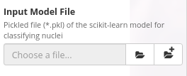
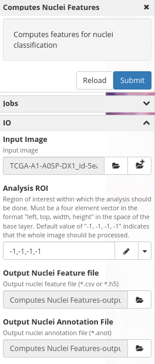
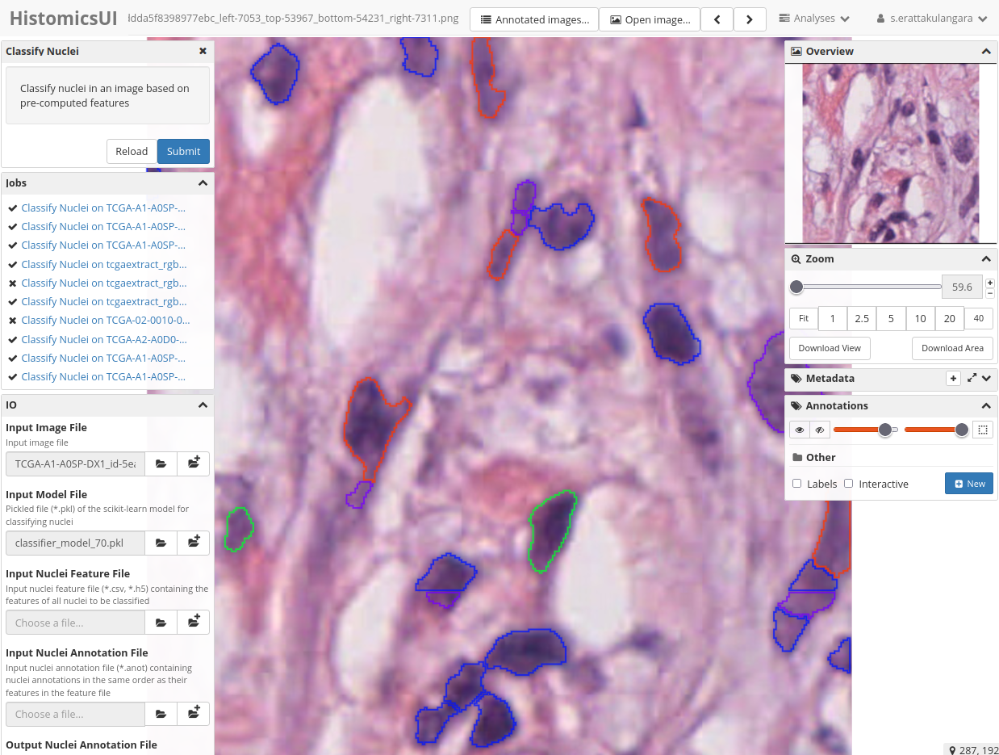

# Nuclei Classification

This tutorial will walk you through the process of running a nuclei classification model using Digital slide archive and HistomicsTK. For this example to run you need a classification model which is trained using both nuclei features and annotation. In this example, we are providing a classification model which is trained on the [breast cancer histopathalogy images](https://nucls.grand-challenge.org/).

Input files required by **Nuclei Classification CLI**:
1. Input image (open-source image from the grand challenge) - [download link](https://data.kitware.com/api/v1/file/hashsum/sha512/25b67911881807a0453fe213b9ab77dbf37ec7aaf77fea98407ff06412eb849fdaa2cee4b5412fd03437b428deb2b013174af36411900fd9c5a71de7c84f3cfe/download).
2. Classification model as a `.pkl` file - [download link](https://data.kitware.com/api/v1/file/hashsum/sha512/2bcdc057f50726b8cd7376695290b223a1548c1a2e44267a3d4da90988d4af1569ff181350cc04ad7095f8cf434c35e6fc54466ea4b67bfc41ada55ba2237d23/download)
3. Nuclei annotations. (optional)
4. Extracted nuclei features. (optional)

*Tutorial created by Subin Erattakulangara (Kitware)*

## Step 1

Launch an image within the DSA interface and navigate to the *Nuclei classification panel*. The appearance of the panel will resemble the provided image below. You can obtain the exemplar image from the following source above.

## Step 2

Download the trained model from the resource given above or generate a classification model using your dataset and subsequently upload the corresponding file to the designated **Input Model File** section. A tutorial for training the classifier can be found in this [example](link to second tutorial).

## Step 3 (optional)

Users can easily create individual *nuclei feature* and *nuclei annotation* files by accessing the **ComputeNucleiFeaturesPanel** in DSA. This approach offers a more convenient method for adjusting the output feature and annotation files according to their preferences.

## Step 4

DSA incorporates inherent functionality for generating both nuclei features and nuclei annotations in instances where users omit furnishing these for nuclei classification. Consequently, you can simply select the **Submit** option and await the system to autonomously generate the outcomes. The outcomes will bear resemblance to the provided reference image below.

